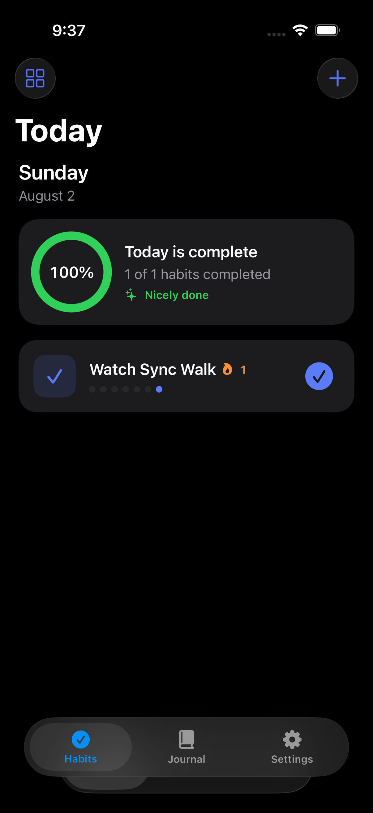
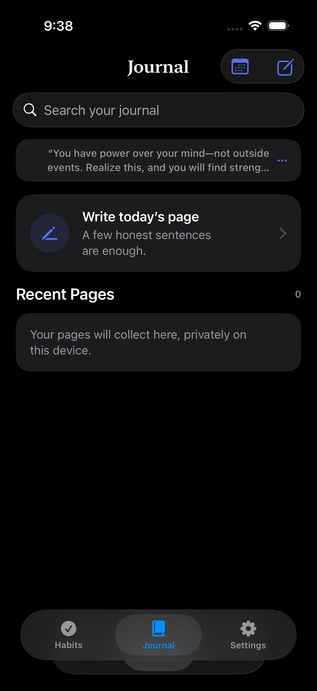
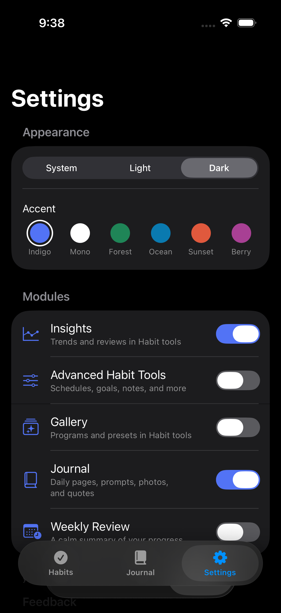
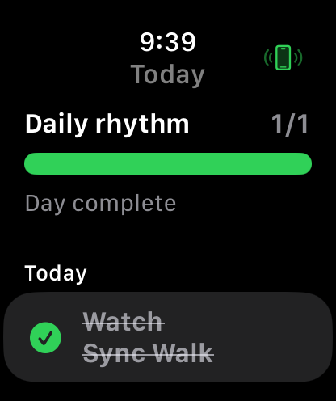

  

<h1 align="center">Vivere</h1>

  <em>Vivere</em> — Latin for “to live.” A polished, completely free, local-first companion for intentional living on iPhone and Apple Watch.

  <strong>No account · No ads · No subscription · No third-party SDKs</strong>

  
  
  
  

## Built to stay simple—and grow when you need it

Vivere opens to a calm Today screen with one-tap completion. Optional capabilities live behind switches in Settings, so a new user gets a focused tracker while an advanced user can enable schedules, measurable goals, programs, insights, journaling, reminders, and review tools without installing another app.

### Everyday experience

- Fast one-tap check-ins with subtle haptics and restrained animation
- Daily, selected-weekday, and flexible weekly schedules
- Check-in, count, duration, and avoidance goals
- Schedule-aware streaks, adherence, history, and calendar detail
- Reordering, pausing, archiving, notes, preferred time, and reminders
- Full light, dark, system, and six accent-color themes
- Dynamic Type, VoiceOver labels, Reduce Motion support, and adaptable layouts

### Premium-style tools, still free

- Customizable program gallery, including 75-Day Hard Reset and 125-Day Lock In
- Difficulty levels and editable habits before starting any preset
- Private daily Journal with search, calendar, prompts, and optional photos
- Compact daily motivation with categories, favorites, and sharing
- Quote rotation that uses every enabled quote before repeating
- Insights and optional weekly reviews
- Local JSON backup and non-destructive restore
- Siri and Shortcuts actions through App Intents
- Small and medium Today widgets
- Apple Watch Today list with cached offline state and one-tap completion sync

## Local-first by design

The iPhone is the single source of truth. Habits, completions, configuration, and journal entries are stored in Core Data on the device. The Watch receives a compact cached snapshot and sends idempotent completion requests through WatchConnectivity; it never opens or migrates the iPhone database.

The project includes lightweight migration from the original V1 store through the current V3 model, plus readable JSON backup and merge-based restore. Existing data is preserved whenever the model can be safely opened.

## Apple frameworks only

| Capability | Framework |
| --- | --- |
| Interface and accessibility | SwiftUI |
| Local persistence and migration | Core Data |
| Home Screen widgets | WidgetKit |
| Siri and Shortcuts | App Intents |
| Local reminders | UserNotifications |
| Journal photo picker | PhotosUI |
| iPhone–Watch sync | WatchConnectivity |

There are no paid dependencies, analytics SDKs, advertising frameworks, remote accounts, or hosted databases.

## Requirements

- iOS 17.0 or later
- watchOS 10.0 or later for the companion app
- Xcode with the iOS and watchOS simulator runtimes installed
- Development testing is focused on iPhone 12 and newer, including Pro Max layouts

## Run locally

1. Clone the repository and open `HabitTracker.xcodeproj` in Xcode.
2. Select the `HabitTracker` scheme and an iPhone simulator.
3. Confirm your development team under Signing & Capabilities when installing on a physical device.
4. Build and run with <kbd>⌘R</kbd>.

The Watch app is embedded in the iPhone target. To test it, select the `HabitTrackerWatch Watch App` scheme and a compatible paired Watch simulator.

## Validation

The release-candidate branch has been checked with:

- Clean iPhone + widget + Watch simulator builds
- 21 iPhone unit and migration tests
- Watch snapshot/model unit test and launch UI test
- Full iPhone 12 UI suite, including repeated launch and launch performance
- iPhone 16 Pro Max portrait, landscape, light, and dark checks
- Static analyzer and Address Sanitizer
- V1-to-V3 Core Data migration coverage
- Accessibility-extra-large Dynamic Type visual verification
- Live paired-simulator iPhone → Watch sync and Watch → iPhone completion
- Simulator crash-report and fault-log review

## Project status

Vivere is an actively developed release candidate. Before distributing broadly, archive it with your own Apple Developer signing, run the final real-device beta pass, and review the App Store privacy and metadata forms for your distribution account.

---

Built around a simple idea: useful personal software should respect your attention, your privacy, and your wallet.
